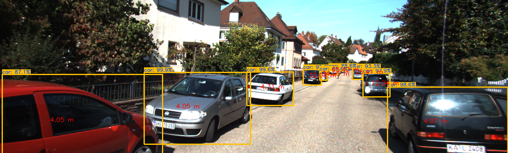

# stereo_vision_course
Repository for the course: https://courses.thinkautonomous.ai/stereo-vision

* YOLOv4 Weights File Available through the course.

The goal of this course is to learn how to estimate distances with Stereo Geometry.

* YOLOv4 with Tensorflow 2: https://pypi.org/project/yolov4/

* LiDAR-Camera Projections: https://github.com/darylclimb/cvml_project/tree/master/projections/lidar_camera_projection
